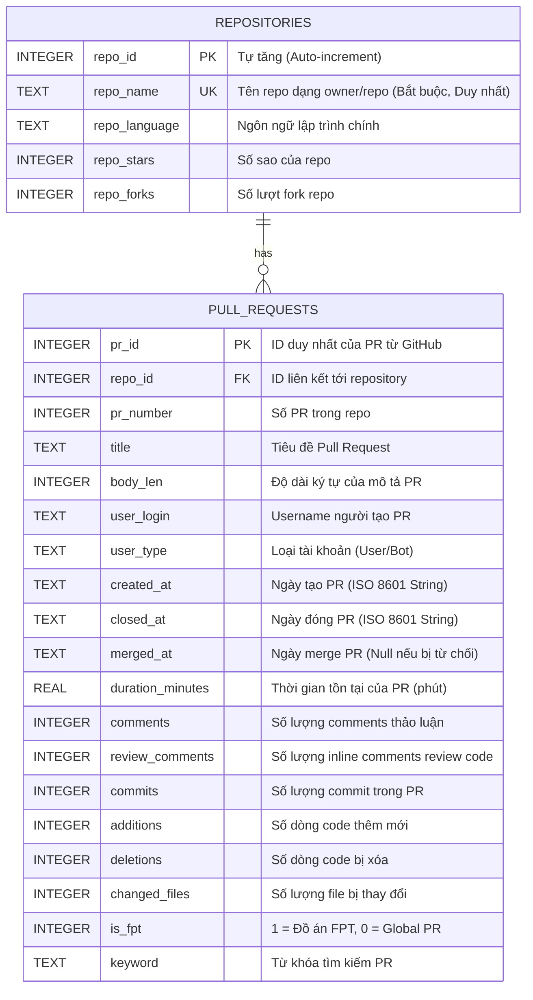

# Tài liệu Thiết kế Cơ sở dữ liệu (Database Schema Documentation)

Tài liệu này mô tả chi tiết thiết kế cơ sở dữ liệu SQLite của dự án tại [github_prs.db](file:///e:/_FPT_UNI_/Ki%203/ADY/fpt%20repo%20checking/database/github_prs.db). Dữ liệu đã được chuẩn hóa để loại bỏ trùng lặp và phân tách thông tin giữa **Repository** và **Pull Request**.

---

## 1. Sơ đồ thực thể liên kết (Entity-Relationship Diagram - ERD)

Dưới đây là sơ đồ ERD thể hiện mối quan hệ giữa các bảng:



---

## 2. Mô tả chi tiết các bảng (Table Dictionary)

### Bảng 1: `repositories`
Lưu trữ thông tin về các kho mã nguồn (Repositories) được cào từ GitHub.

| Tên trường (Column) | Kiểu dữ liệu | Khóa | Ràng buộc / Mặc định | Ý nghĩa (Description) |
| :--- | :---: | :---: | :---: | :--- |
| **repo_id** | INTEGER | PK | AUTOINCREMENT | ID định danh tự sinh trong hệ thống. |
| **repo_name** | TEXT | UK | UNIQUE, NOT NULL | Tên đầy đủ của repo (ví dụ: `hhnam746/SWP391-BE`). |
| **repo_language**| TEXT | | | Ngôn ngữ lập trình chủ đạo của repo. |
| **repo_stars** | INTEGER | | DEFAULT 0 | Số lượt gắn sao (Stars) của repository. |
| **repo_forks** | INTEGER | | DEFAULT 0 | Số lượt nhân bản (Forks) của repository. |

---

### Bảng 2: `pull_requests`
Lưu trữ thông tin chi tiết về từng Pull Request.

| Tên trường (Column) | Kiểu dữ liệu | Khóa | Ràng buộc / Mặc định | Ý nghĩa (Description) |
| :--- | :---: | :---: | :---: | :--- |
| **pr_id** | INTEGER | PK | | ID duy nhất toàn cầu của PR từ GitHub. |
| **repo_id** | INTEGER | FK | NOT NULL, REFERENCES `repositories` | Khóa ngoại liên kết tới repo chứa PR này. |
| **pr_number** | INTEGER | | NOT NULL | Số thứ tự PR trong nội bộ repo đó (ví dụ: `#12`). |
| **title** | TEXT | | | Tiêu đề của Pull Request. |
| **body_len** | INTEGER | | DEFAULT 0 | Độ dài mô tả PR (đo lường nỗ lực viết tài liệu). |
| **user_login** | TEXT | | | Username của tác giả tạo PR. |
| **user_type** | TEXT | | | Loại tài khoản tạo PR (User hoặc Bot). |
| **created_at** | TEXT | | | Thời gian tạo PR (Định dạng UTC ISO 8601). |
| **closed_at** | TEXT | | | Thời gian đóng PR. |
| **merged_at** | TEXT | | | Thời gian PR được merge (NULL nếu PR bị đóng/revert). |
| **duration_minutes**| REAL | | | Thời gian từ lúc mở tới lúc merge/close (phút). |
| **comments** | INTEGER | | DEFAULT 0 | Số comment thảo luận chung trên PR. |
| **review_comments**| INTEGER | | DEFAULT 0 | Số comment review trực tiếp trên từng dòng code. |
| **commits** | INTEGER | | DEFAULT 0 | Số lượng commit trong PR này. |
| **additions** | INTEGER | | DEFAULT 0 | Số dòng code được thêm vào. |
| **deletions** | INTEGER | | DEFAULT 0 | Số dòng code bị xóa đi. |
| **changed_files** | INTEGER | | DEFAULT 0 | Số lượng file bị xáo trộn/thay đổi. |
| **is_fpt** | INTEGER | | CHECK (0, 1) | Nhãn phân loại: 1 = FPT University, 0 = Global PR. |
| **keyword** | TEXT | | | Từ khóa cào (ví dụ: `SWP391`, `PRJ301`, `global`). |

---

### Bảng 3 (Staging): `raw_pull_requests`
Bảng chứa dữ liệu thô nguyên bản từ file CSV để làm nguồn đối chiếu và phục vụ truy vết dữ liệu gốc. Cấu trúc gồm 22 cột phẳng khớp hoàn toàn với file CSV.

---

## 3. Cách kết nối và truy vấn

Dữ liệu đã được tiền xử lý và cung cấp một View phân tích cực kỳ tiện lợi là `view_pr_clean` giúp chuẩn hóa thời gian và dán nhãn trạng thái của PR.

### Truy vấn lấy dữ liệu sạch trong SQLite:
```sql
SELECT * FROM view_pr_clean LIMIT 5;
```

### Cách kết nối trong Jupyter Notebook (cho Thịnh):
```python
import sqlite3
import pandas as pd

# 1. Tạo kết nối tới file database
conn = sqlite3.connect('../database/github_prs.db')

# 2. Đọc dữ liệu từ View đã chuẩn hóa vào DataFrame
df = pd.read_sql_query("SELECT * FROM view_pr_clean", conn)

# 3. Xem thử 5 dòng đầu
print(df.head())
```
